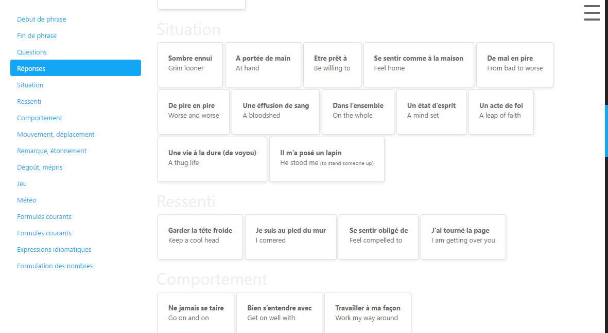

# MEMOLINGUO

[Website](https://chrisbo246.github.io/memolinguo/)

Easy to write / learn vocabulary lists powered by Jekyll and Bootstrap 4.

## Features

- Quick definition list edition thanks to the freshly supported markdown syntax.
- Convert definition lists (dl) to easy-reading Bootstrap 4 cards.
- Fade memorized definitions (with persistence).
